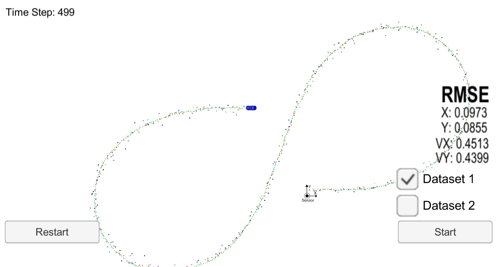
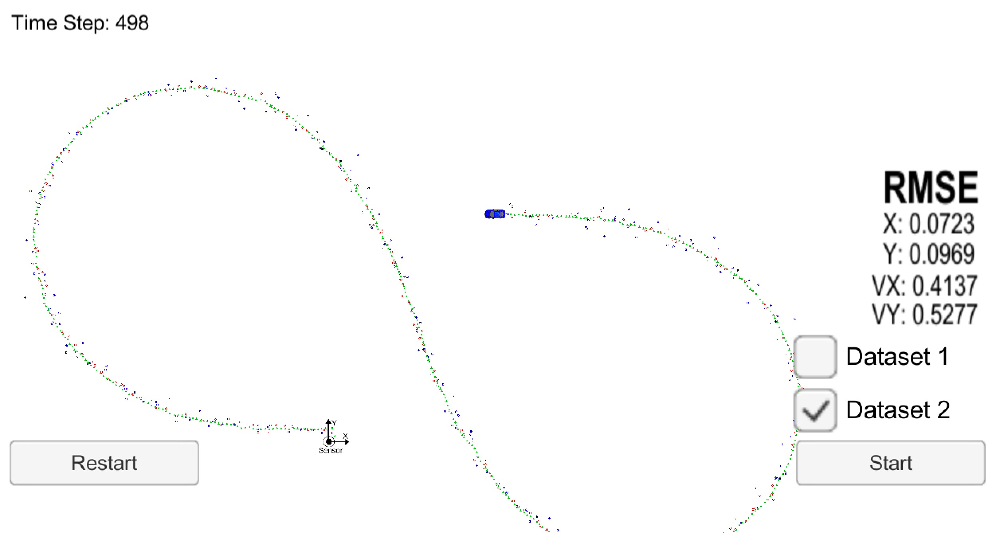

## Extended Kalman Filter Project
---
Yangchun Luo

Jan 14, 2018

This is the assignment for Udacity's Self-Driving Car Term 2 Project 1.

---

The goal of this project is to utilize a kalman filter to estimate the state of a moving object of interest with noisy lidar and radar measurements. Passing the project requires obtaining RMSE values that are lower that the tolerance outlined in the project rubric. 

### To build

```bash
mkdir build
cd build
cmake ..
make
./ExtendedKF
```

### To run

Download the [Term 2 simulator suite](https://github.com/udacity/self-driving-car-sim/releases). Open it and choose the EKF project.

Other setup information can be found in the original [README](README-orig.md) file.

### Performance evaluation

<table>
<tr><th>Dataset<th>X RMSE<th>Y RMSE<th>Vx RMSE<th>Vy RMSE
<tr><td>Dataset1<td>0.0973<td>0.0855<td>0.4513<td>0.4399
<tr><td>Dataset2<td>0.0723<td>0.0969<td>0.4137<td>0.5277
</table>

#### Dataset1


#### Dataset2

